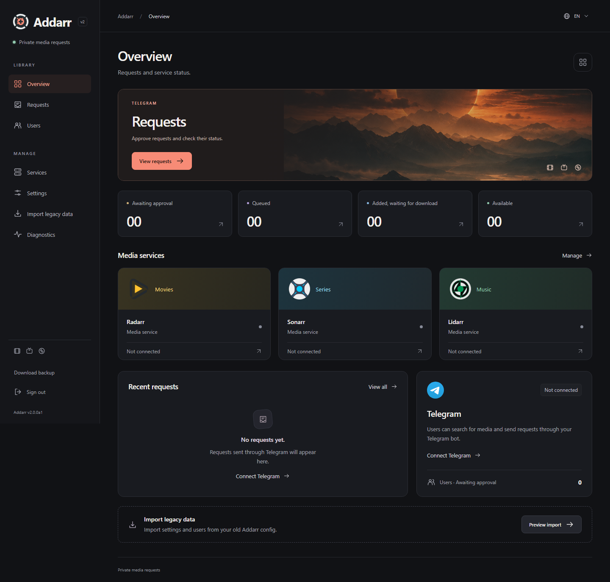

# Addarr

Addarr is a Telegram bot for requesting movies, TV shows and music. It connects to Radarr, Sonarr and Lidarr, with a web interface for managing requests, users and settings.

It supports whole series, selected seasons, artists and individual albums. Requests need approval by default.

Version 2 is a rebuild of Addarr Refresh and is still in alpha. See [implementation status](docs/IMPLEMENTATION-STATUS.md).



## Docker setup

For now, build the image from this checkout:

```sh
mkdir -p config
docker compose build
docker compose up -d
```

The container needs write access to `config`. On Linux, run `sudo chown 1000:1000 config`, or set `PUID` and `PGID` in `.env` to match the directory's owner before starting it.

Open <http://127.0.0.1:8090>. To access Addarr from another device, set `ADDARR_BIND` in `.env` to your server's LAN address. The web interface is intended for use over a LAN or VPN.

The Compose file accepts these settings:

| Variable | Default | Purpose |
| --- | --- | --- |
| `ADDARR_BIND` | `127.0.0.1` | Address the web interface listens on |
| `ADDARR_PORT` | `8090` | Web interface port |
| `ADDARR_CONFIG` | `./config` | Directory for settings and data |
| `PUID` / `PGID` | `1000` / `1000` | Container user and group |
| `ADDARR_VERSION` | `2.0.0a1` | Docker image tag |

### First run

1. Copy the token from `config/bootstrap-token` into the setup page and create an admin account. The token file is deleted after setup.
2. Open **Services** and enter a service's URL and API key. Click **Test connection** to load its profiles and folders, choose the defaults, then save. Lidarr also needs a metadata profile. Saved services reload these choices when you open the page.
3. In **Settings**, enter your Telegram bot token, choose a language and enable the bot. At least one service must be configured first. If an older Addarr instance uses the same token, stop it before enabling this one.
4. Send `/start` to the bot in a private chat. Open **Users**, check the Telegram user ID and approve access. Once the bot is connected, you can also create a single-use invite.

For an existing installation, see [Migration](#migration).

Service addresses must be reachable from inside the container. Use a LAN address or a service name on a shared Docker network. `localhost` points to the Addarr container itself.

Settings, users and request history are stored in `/config`. Keep this directory on storage local to the Docker host rather than an SMB or NFS share. The application uses SQLite and runs with a read-only application filesystem.

## Using the bot

| Command | Action |
| --- | --- |
| `/start` | Open the main menu, including artist and album requests |
| `/movie` | Search for a movie |
| `/series` | Search for a series |
| `/music` | Search for an artist |
| `/requests` | View requests; admins can also approve or reject them |
| `/status` | Check the connected services |
| `/help` | Show instructions |
| `/cancel` | Cancel the current search or selection |

Choose a result, check the details and confirm. Requests use the admin's defaults unless you select other permitted profiles, folders or monitoring options.

Album requests monitor only the selected album. Additional requests preserve existing library settings.

Added requests have reached Radarr, Sonarr or Lidarr but may not have finished downloading. Addarr checks availability and sends updates through Telegram. Adjust notifications in **Settings**.

To skip manual approval, enable **Automatically approve all requests** under **Settings > Requests**. This applies to new requests from active users. Existing pending requests still need review. When this option is off, per-user automatic approval still applies.

The bot and web interface support English, German, Spanish, French, Italian, Dutch, Polish, Portuguese and Russian. Each has a language selector.

## Migration

Open **Import legacy data** and upload your old `config.yaml`. You can also include `admin.txt`, `allowlist.txt` and `chatid.txt`.

Review the preview before importing. The import creates a database backup, leaves the original files alone and keeps the bot disabled. Existing service configurations are not overwritten.

After importing, check profiles, folders, exclusions and monitoring settings in **Services**. Approve imported users in **Users**. The old shared password is no longer used, and group chat IDs are not imported.

You can also preview and apply an import from the command line:

```sh
uv run addarr --data-dir ./config migrate /path/to/old/install
uv run addarr --data-dir ./config migrate /path/to/old/install --apply
```

The old code is tagged as `legacy/pre-v2`.

### Not supported in v2 yet

Download-client controls, library deletion, group chats, multiple instances of the same service, native installers and Helm are not included. The old `src/`, `helm/` and installer files remain in the repository but are not used by v2. Do not use the old install scripts with this branch.

## Backups and password recovery

Use **Download backup** in the web sidebar, or run:

```sh
uv run addarr --data-dir ./config backup /safe/location/addarr.db
```

Backups include service credentials and admin account data, so store them somewhere private.

To reset a web account's password:

```sh
uv run addarr --data-dir ./config reset-password USERNAME
```

The command prompts for a new password without displaying it and signs out all web sessions.

## Development

Requires Python 3.13 and uv.

```sh
uv sync --frozen --group dev
uv run addarr --data-dir ./config serve --host 127.0.0.1
```

Run the checks with:

```sh
uv run pytest -q
uv run mypy addarr
uv run ruff check addarr tests
```

`python run.py` also starts Addarr once the dependencies are installed. Put `--data-dir` before the subcommand. `--help` and `--version` work without a configuration file.

See [Architecture](docs/ARCHITECTURE.md) for request states and error handling, and the [release checklist](docs/RELEASE-CHECKLIST.md) for browser, container, migration and live-service testing.

## License

Addarr uses the [MIT license](LICENSE). The bundled HTMX license is in [addarr/static/htmx.LICENSE](addarr/static/htmx.LICENSE). Application logo sources are listed in [addarr/static/logos/SOURCES.md](addarr/static/logos/SOURCES.md).
